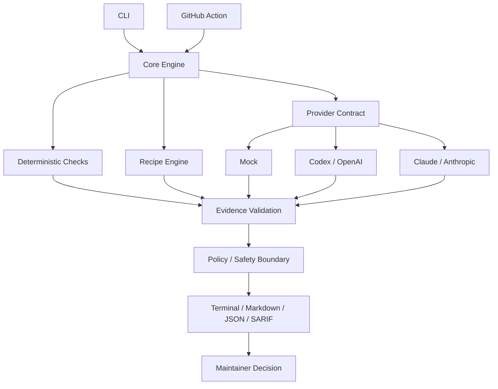

<div align="center">

# ⚒️ AunoForge

### AI-assisted maintenance you can verify.

**Review code. Triage issues. Reproduce bugs. Inspect security evidence. Prepare releases.**  
Keep repository authority with maintainers — not with the model.

[](https://github.com/dhtoan/AunoForge/actions/workflows/ci.yml)
[](https://github.com/dhtoan/AunoForge/actions/workflows/aunoforge-review.yml)
[](LICENSE)
[](https://nodejs.org/)
[](CONTRIBUTING.md)
[](https://github.com/dhtoan/AunoForge/stargazers)

[](docs/concepts/providers.md)
[](docs/concepts/providers.md)
[](docs/concepts/security.md)

**Provider-neutral · Evidence-aware · Read-only by default · Human-controlled**

> **AI proposes. AunoForge verifies. Maintainers decide.**

[Get Started](#-60-second-proof) · [Capabilities](#-what-aunoforge-does) · [Security](#-security-by-default) · [Docs](docs/) · [Roadmap](ROADMAP.md) · [Contribute](CONTRIBUTING.md)

</div>

---

## ⚡ 60-second proof

The fastest safe proof is the published **v0.1.0** GitHub Action with the zero-key `mock` provider. It runs with read-only permissions and does not post PR comments.

Create `.github/workflows/aunoforge.yml`:

```yaml
name: AunoForge Proof

on:
  pull_request:

permissions:
  contents: read
  issues: read
  pull-requests: read

jobs:
  review:
    runs-on: ubuntu-latest
    steps:
      - uses: actions/checkout@3d3c42e5aac5ba805825da76410c181273ba90b1 # v7.0.1

      - uses: dhtoan/AunoForge@v0.1.0
        with:
          provider: mock
          format: markdown
          comment: 'false'
```

No API key is required. A maintained smoke workflow runs the stable `v0.1.0` release, and the full copy-paste example lives at [docs/examples/aunoforge-review.yml](docs/examples/aunoforge-review.yml).

### Verified v0.1.0 output

```text
# AunoForge Review

Recommendation: **approve**

Critical: 0 · High: 0 · Medium: 0 · Low: 0 · Info: 0

No findings.
```

> **Stable vs. current main:** `v0.1.0` is the published stable Action. Current `main` contains upcoming v0.2 work including SARIF output, incremental baselines, Step Summary integration, the prebuilt Node 24 Action runtime, configuration presets, security intelligence, and release intelligence. Use the explicitly labeled [v0.2/current-main example](docs/examples/aunoforge-review-v0.2.yml) when evaluating unreleased capabilities.

---

## Why AunoForge?

AI can produce a convincing code review in seconds. The hard part is deciding whether that review is **grounded in the repository, safe to act on, reproducible, and compatible with maintainer policy**.

AunoForge is a verification layer for AI-assisted maintenance. It combines deterministic checks, structured model output, repository evidence, explicit policy boundaries, and human approval into one workflow.

| Typical AI workflow | AunoForge workflow |
|---|---|
| Model prose is treated as the result | Findings are structured and checked against repository evidence |
| Provider behavior leaks into the whole tool | Providers sit behind one contract |
| Write access can become implicit | Read-only is the default; writes require explicit authorization |
| Reviews are difficult to compare over time | JSON reports and incremental baselines make changes inspectable |
| Release notes can become generated guesswork | Release intelligence is derived from Git and optional GitHub evidence |
| Security scans often hide network behavior | Dependency inventory is offline by default; advisory enrichment is explicit |

AunoForge treats repository content, issue text, pull-request descriptions, comments, recipes, and model output as **untrusted input**.

It does not let a model grant itself permissions, silently mutate your repository, merge a pull request, publish a package, or turn hallucinated file references into trusted findings.

---

## ✨ What AunoForge does

| Capability | Surface | Purpose | Default posture |
|---|---|---|---|
| 🩺 **Repository doctor** | `aunoforge doctor` | Scores repository maintenance health with deterministic checks | Read-only |
| 🏷️ **Issue triage** | `aunoforge triage` | Suggests issue type, severity, area, labels, and next actions | No issue mutation |
| 🧪 **Bug reproduction** | `aunoforge reproduce` | Converts issue evidence into a structured reproduction plan | Read-only |
| 🔍 **Evidence-aware review** | `aunoforge review` | Runs six review passes, deterministic checks, and evidence validation | Read-only |
| 🛡️ **Security intelligence** | `aunoforge security` | Inventories supported Node dependency evidence; optional OSV enrichment | Offline by default |
| 📦 **Release intelligence** | `aunoforge release` | Derives categorized release evidence and semantic-version guidance | No publishing |
| ⚙️ **Project configuration** | `.aunoforge/config.json` | Applies versioned presets and deterministic precedence | Cannot grant write permission |
| 🧩 **Recipes** | `recipes list`, `recipe validate`, `recipe test` | Extends maintenance workflows declaratively | No arbitrary recipe execution |
| 🤖 **Provider adapters** | `mock`, `codex`, `claude` | Keeps provider APIs behind one contract | Explicit provider selection |
| 🔁 **GitHub Action** | `uses: dhtoan/AunoForge@v0.1.0` | Runs the stable review workflow in CI | Comments disabled by default |

### A maintainer-controlled data path

```text
Repository / Issue / Pull Request
              │
              ▼
        AunoForge Core
              │
      ┌───────┼───────────┐
      │       │           │
Deterministic Recipes   Provider
  checks      engine     adapter
      │       │           │
      └───────┼───────────┘
              ▼
      Evidence validation
              │
              ▼
       Policy boundary
              │
              ▼
 Terminal / Markdown / JSON / SARIF*
              │
              ▼
        Human decision

* SARIF is current-main / upcoming v0.2.
```

---

## 🚀 CLI quick start

### Requirements

- Node.js **20 or newer**
- pnpm **10.15.1** for source development

### Safe first run

```bash
npx aunoforge doctor
npx aunoforge review --provider mock --format markdown
```

The `mock` provider makes **no external model request**. Deterministic checks still run, so it is the safest first look at AunoForge behavior.

Until the first npm publication, clone the repository and run the built CLI directly:

```bash
git clone https://github.com/dhtoan/AunoForge.git
cd AunoForge

corepack enable
corepack prepare pnpm@10.15.1 --activate
pnpm install
pnpm build

node packages/cli/dist/bin.js doctor --root .
node packages/cli/dist/bin.js review --root . --provider mock --format markdown
```

See [Getting Started](docs/getting-started.md) for the full setup path.

---

## 🔍 Evidence-aware review

`aunoforge review` runs exactly six model review passes — correctness, regression, security, compatibility, test coverage, and breaking changes — plus deterministic checks.

A generated finding is not automatically trusted:

```text
Model / deterministic finding
            │
            ▼
      Schema validation
            │
            ▼
      File exists?
      Line exists?
      Evidence matches?
            │
      ┌─────┴─────┐
      │           │
   verified    unverified
      │           │
      ▼           ▼
   report      downgrade /
                reject location
```

A finding can carry severity, category, file and line range, source, evidence, explanation, verification steps, and confidence.

### Local diff

```bash
npx aunoforge review \
  --root . \
  --provider mock \
  --format markdown
```

### GitHub pull request

```bash
npx aunoforge review \
  --pr 42 \
  --owner OWNER \
  --repo REPO \
  --provider codex \
  --model MODEL \
  --format json
```

### Incremental comparison on current main

```bash
node packages/cli/dist/bin.js review \
  --root /path/to/repo \
  --provider mock \
  --diff ./change.diff \
  --baseline ./previous-aunoforge-review.json \
  --format json
```

Baseline comparison is fingerprint-based and reports `new`, `persistent`, `resolved`, and `regressed` findings. AunoForge does not remotely store or auto-discover your baseline.

Read [Review Command](docs/commands/review.md).

---

## 🛡️ Security intelligence

`aunoforge security` inventories supported Node dependency evidence without modifying the repository.

```bash
npx aunoforge security --format json
```

It is **offline by default**. Declared ranges remain declaration evidence, and resolved versions are reported only when a supported lockfile proves them.

Optional OSV-compatible enrichment is explicit:

```bash
npx aunoforge security --format json --advisory osv
```

This opt-in sends only proven resolved package versions to the advisory adapter. It does not run a package manager, update manifests or lockfiles, create commits, or write to GitHub.

Read [Security Command](docs/commands/security.md).

---

## 📦 Release intelligence

`aunoforge release` prepares deterministic release intelligence from repository history and optional GitHub metadata.

```bash
npx aunoforge release --root . --from v0.1.0
npx aunoforge release --root . --from v0.1.0 --format json --dry-run
```

It normalizes release-worthy evidence into **Breaking, Features, Fixes, Security, and Maintenance**, then recommends the highest evidence-backed semantic-version bump.

The command does **not** create tags, modify repository files, push branches, publish a GitHub release, or publish a package. Release guidance remains a maintainer decision.

Read [Release Command](docs/commands/release.md).

---

## ⚙️ Configuration and presets

Project configuration lives at `.aunoforge/config.json` and uses a versioned allowlisted schema.

```json
{
  "schemaVersion": 1,
  "extends": "recommended"
}
```

Built-in preset IDs:

`recommended` · `minimal` · `strict` · `security` · `node` · `python` · `wordpress`

Resolution is deterministic:

```text
explicit CLI/action input
        > project config
        > built-in preset
        > surface default
        > terminal fallback
```

Project configuration and presets **cannot grant write permission**, inject credentials, or enable merge/publish authority. Unknown security-sensitive keys fail closed.

```bash
npx aunoforge config validate --root .
npx aunoforge init --root . --dry-run
```

Read [Configuration](docs/commands/config.md).

---

## 🤖 Providers

AunoForge core uses a provider-neutral contract. Credentials remain inside the selected adapter and are not copied into normalized repository context.

| Provider | Network request | Credential | Best for |
|---|---:|---|---|
| **Mock** | No | None | Offline development, CI fixtures, deterministic first pass |
| **Codex / OpenAI** | Yes | `OPENAI_API_KEY` | Structured AI-assisted maintenance workflows |
| **Claude / Anthropic** | Yes | `ANTHROPIC_API_KEY` | Structured AI-assisted maintenance workflows |

```bash
# Codex / OpenAI
export OPENAI_API_KEY="..."
npx aunoforge review --provider codex --model <model-name>

# Claude / Anthropic
export ANTHROPIC_API_KEY="..."
npx aunoforge review --provider claude --model <model-name>
```

Model names remain configuration rather than hard-coded policy because provider catalogs change over time.

Read [Provider Concepts](docs/concepts/providers.md).

---

## 🧩 Recipe ecosystem

Recipes are versioned, declarative maintenance workflows that extend AunoForge **without changing the core engine**.

AunoForge v0.1 ships **11 builtin recipes** spanning general maintenance, GitHub workflows, WordPress, WooCommerce, Node.js, Python, and Django.

```yaml
schema: aunoforge.dev/recipe/v1
id: wordpress/plugin-review
name: WordPress Plugin Review
version: 1

applies_to:
  - wordpress-plugin

passes:
  - correctness
  - security
  - backwards-compatibility
  - i18n
  - performance
```

Recipes do not receive arbitrary shell or network execution in v0.1.

```bash
npx aunoforge recipes list
npx aunoforge recipe validate path/to/recipe.yml
npx aunoforge recipe test path/to/recipe.yml
```

Adding a recipe or fixture is one of the smallest useful contribution paths. Read [Recipes](docs/concepts/recipes.md) and the [Recipe Contribution Guide](docs/contributing/recipes.md).

---

## 🔐 Security by default

AunoForge is designed around one rule:

> **Model output is untrusted until it survives repository evidence and maintainer policy.**

Its regression suite protects invariants including:

- models cannot grant themselves permissions
- recipes cannot bypass the policy engine
- untrusted repository text cannot become system instructions
- secrets must not unintentionally enter model context
- read-only mode performs zero repository mutations
- invalid paths cannot escape the repository root
- fork PRs cannot execute secret-bearing commands
- invalid provider output cannot bypass schema validation
- GitHub writes require explicit permission
- model output cannot simulate human approval

The stable GitHub Action defaults to read-only review and no comments. To permit a PR comment, a calling workflow must explicitly grant `pull-requests: write` **and** enable both `comment: 'true'` and `allow-write: 'true'`.

AunoForge never auto-merges a pull request from this workflow.

Read the [Security Model](docs/concepts/security.md) and [Security Policy](SECURITY.md).

---

## ⚙️ GitHub Action: stable and current-main

### Stable v0.1.0

Use the stable tag when you want the published release contract:

```yaml
- uses: actions/checkout@3d3c42e5aac5ba805825da76410c181273ba90b1 # v7.0.1
- uses: dhtoan/AunoForge@v0.1.0
  with:
    provider: mock
    format: markdown
    comment: 'false'
```

### Current main / upcoming v0.2

Use the current-main example only when intentionally testing unreleased capabilities. The maintained example demonstrates SARIF output, explicit baseline input, Step Summary/annotation behavior, and optional artifact persistence:

[View the current-main v0.2 example →](docs/examples/aunoforge-review-v0.2.yml)

AunoForge's own stable smoke intentionally exercises `dhtoan/AunoForge@v0.1.0`; third-party GitHub Actions in maintained workflows are pinned to reviewed full commit SHAs and tracked by weekly Dependabot updates.

---

## 🧱 Architecture



Core principles:

1. **Maintainer-first**
2. **Provider-neutral**
3. **Evidence-aware**
4. **Security-by-default**
5. **Community-extensible**

See [Architecture Overview](docs/architecture/overview.md).

---

## 📁 Project structure

```text
aunoforge/
├── packages/
│   ├── cli/
│   ├── core/
│   ├── github/
│   ├── providers/
│   ├── recipes/
│   └── reporters/
├── recipes/
├── fixtures/
├── docs/
├── scripts/
├── test/
├── .github/
│   └── workflows/
├── action.yml
├── CONTRIBUTING.md
├── SECURITY.md
├── ROADMAP.md
└── OSS-EVIDENCE.md
```

---

## 🧪 Development and verification

```bash
git clone https://github.com/dhtoan/AunoForge.git
cd AunoForge

corepack enable
corepack prepare pnpm@10.15.1 --activate
pnpm install

pnpm build
pnpm lint
pnpm typecheck
pnpm test
```

Maintained CI covers the Node.js **20 / 22 / 24** quality matrix plus macOS and Windows platform smoke.

Release-readiness checks also verify the packaged Action runtime rather than assuming generated files match source.

---

## 🤝 Contributing

Useful first contributions include:

- adding a maintenance recipe
- adding a known-good or known-bad fixture
- improving secret detection patterns
- extending project detection
- improving Windows/macOS/Linux portability
- improving documentation or copy-paste examples
- contributing provider work as the external contract stabilizes

Start with [CONTRIBUTING.md](CONTRIBUTING.md), the [Recipe Contribution Guide](docs/contributing/recipes.md), [ROADMAP.md](ROADMAP.md), and the [Code of Conduct](CODE_OF_CONDUCT.md).

AunoForge intentionally avoids fake adoption signals, empty releases, synthetic contributors, and trivial activity campaigns. Public OSS evidence should represent real maintainer and community activity.

---

## 🗺️ Project direction

**v0.1** established the trustworthy maintainer CLI, provider adapters, recipe contract, evidence validation, safe-mode policy, security regression suite, and read-only-by-default GitHub Action.

**Current main / upcoming v0.2** is hardening GitHub-native review and evidence workflows: report artifacts, SARIF, incremental baselines, Step Summary integration, configuration presets and precedence, security intelligence, release intelligence, Action packaging, and supply-chain hygiene.

**v0.3** is reserved for provider and recipe SDK stability informed by real usage.

MCP, IDE integrations, a GitHub App, web dashboard, enterprise policy bundles, richer discovery, and autonomous code-changing workflows remain deferred until evidence justifies them.

The maintained source of truth is [ROADMAP.md](ROADMAP.md).

---

## ❓ FAQ

<details>
<summary><strong>Does AunoForge modify my repository?</strong></summary>

Not by default. Repository writes and GitHub writes are explicit permission boundaries. Project configuration and presets cannot grant write authority.

</details>

<details>
<summary><strong>Do I need Codex or Claude?</strong></summary>

No. The `mock` provider makes no model request, and deterministic checks work without an AI provider. Codex and Claude are optional adapters.

</details>

<details>
<summary><strong>Does AunoForge automatically merge pull requests?</strong></summary>

No. Human merge remains outside AunoForge's automated review boundary.

</details>

<details>
<summary><strong>Can community recipes run arbitrary shell commands?</strong></summary>

No. v0.1 recipes are declarative and capability-scoped. Arbitrary recipe shell/network execution is not part of the default design.

</details>

<details>
<summary><strong>Why validate AI findings against repository evidence?</strong></summary>

Because plausible prose can still cite a nonexistent file, invalid line number, or unsupported conclusion. AunoForge treats generated findings as claims to check, not facts to trust.

</details>

<details>
<summary><strong>Why keep stable and current-main examples separate?</strong></summary>

So users can distinguish the published `v0.1.0` contract from unreleased v0.2 capabilities. Stable examples should be copy-paste safe; current-main examples are intentionally labeled as development surfaces.

</details>

---

## 📊 Verifiable OSS evidence

AunoForge does **not** claim downloads, active repositories, contributor counts, or ecosystem adoption before those measurements exist.

Verified launch facts and future adoption evidence are tracked in [OSS-EVIDENCE.md](OSS-EVIDENCE.md). This keeps public project claims auditable and prevents vanity metrics from becoming product requirements.

---

## 📚 Documentation

| Resource | Description |
|---|---|
| [Getting Started](docs/getting-started.md) | Installation and first commands |
| [Configuration](docs/commands/config.md) | Versioned config, presets, precedence, safety boundary |
| [Review](docs/commands/review.md) | Six-pass review, evidence validation, baselines |
| [Security Command](docs/commands/security.md) | Offline dependency evidence and optional advisories |
| [Release Command](docs/commands/release.md) | Deterministic release intelligence |
| [Architecture](docs/architecture/overview.md) | Core boundaries and data flow |
| [Providers](docs/concepts/providers.md) | Mock, Codex/OpenAI, Claude/Anthropic |
| [Recipes](docs/concepts/recipes.md) | Recipe contract and safety model |
| [Security Model](docs/concepts/security.md) | Trust boundaries and safe defaults |
| [Contributing](CONTRIBUTING.md) | Contribution workflow |
| [Security Policy](SECURITY.md) | Vulnerability reporting |
| [Roadmap](ROADMAP.md) | Project direction |
| [OSS Evidence](OSS-EVIDENCE.md) | Verifiable project evidence |

---

## 📄 License

AunoForge is licensed under the **Apache License 2.0**. See [LICENSE](LICENSE).

---

<div align="center">

### Build safer maintainer workflows without giving an AI the keys to the repository.

**AI proposes. AunoForge verifies. Maintainers decide.**

[⭐ Star AunoForge](https://github.com/dhtoan/AunoForge) · [🚀 Get Started](docs/getting-started.md) · [🐛 Report a Bug](https://github.com/dhtoan/AunoForge/issues) · [🤝 Contribute](CONTRIBUTING.md) · [☕ Support](https://buymeacoffee.com/dhtoan)

</div>
