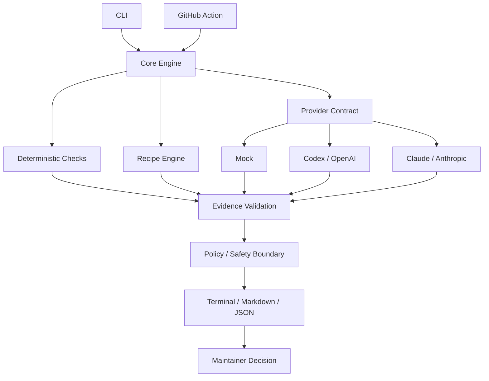

<div align="center">

# ⚒️ AunoForge

### AI-assisted maintenance you can verify.

**Triage issues. Reproduce bugs. Review changes. Check regressions. Prepare releases.**  
Without handing repository control to an AI model.

[](https://github.com/dhtoan/AunoForge/actions/workflows/ci.yml)
[](https://github.com/dhtoan/AunoForge/actions/workflows/aunoforge-review.yml)
[](LICENSE)
[](https://nodejs.org/)
[](CONTRIBUTING.md)
[](https://github.com/dhtoan/AunoForge/stargazers)

[](docs/concepts/providers.md)
[](docs/concepts/providers.md)
[](docs/concepts/security.md)

**Provider-neutral · Evidence-aware · Human-controlled**

> **AI proposes. AunoForge verifies. Maintainers decide.**

[Getting Started](docs/getting-started.md) · [Documentation](docs/) · [Security](SECURITY.md) · [Roadmap](ROADMAP.md) · [Contributing](CONTRIBUTING.md)

</div>

---

## Why AunoForge?

AI can generate a code review in seconds. The harder problem is deciding whether the review is **grounded in the repository, safe to act on, and reproducible by another maintainer**.

AunoForge adds a maintainer-focused verification layer around AI-assisted workflows:

```text
Repository / Issue / Pull Request
              │
              ▼
        AunoForge Core
              │
      ┌───────┼────────┐
      │       │        │
 Deterministic  Recipes  Provider
    checks               adapter
      │       │        │
      └───────┼────────┘
              ▼
     Evidence validation
              │
              ▼
       Maintainer report
              │
              ▼
        Human decision
```

AunoForge treats repository content, issue text, pull-request descriptions, community recipes, comments, and model output as **untrusted input**.

It does not let a model grant itself permissions, silently mutate your repository, merge a PR, publish a package, or turn hallucinated file references into trusted findings.

---

## 🚀 Quick Start

### Requirements

- Node.js **20 or newer**
- pnpm **10.15.1** for source development

### Safe first run

```bash
npx aunoforge doctor
npx aunoforge review --provider mock --format markdown
```

The `mock` provider makes **no external model request**. Deterministic checks still run, so it is the safest way to understand the workflow.

> **Package publication note**  
> Until the first npm publication, clone the repository and run the built CLI directly:

```bash
git clone https://github.com/dhtoan/AunoForge.git
cd AunoForge

corepack enable
corepack prepare pnpm@10.15.1 --activate
pnpm install
pnpm build

node packages/cli/dist/bin.js doctor --root .
node packages/cli/dist/bin.js review --root . --provider mock --format markdown
```

See the full [Getting Started guide](docs/getting-started.md).

---

## ✨ What You Get

| Capability | Command | What it does | Default behavior |
|---|---|---|---|
| 🩺 **Repository doctor** | `aunoforge doctor` | Scores maintenance health using deterministic checks | Read-only |
| 🏷️ **Issue triage** | `aunoforge triage` | Classifies issues and suggests severity, area, labels, and next actions | No issue mutation |
| 🧪 **Bug reproduction** | `aunoforge reproduce` | Converts an issue into a structured reproduction plan | Read-only |
| 🔍 **PR / diff review** | `aunoforge review` | Runs multi-pass review plus evidence validation | Read-only |
| 📦 **Release preparation** | `aunoforge release` | Drafts release notes from Git history and optional PR metadata | No publishing |
| 🧩 **Recipes** | `recipes list`, `recipe validate`, `recipe test` | Extends workflows without changing core | No arbitrary execution |
| 🤖 **Provider adapters** | `mock`, `codex`, `claude` | Keeps model-specific APIs behind one contract | Explicit provider selection |
| ⚙️ **GitHub Action** | `uses: dhtoan/AunoForge@main` | Runs AunoForge review in CI | `comment: false` |

---

## 🔍 Evidence-Aware Review

AunoForge does not treat model prose as a trusted result.

A review flows through structured validation:

```text
Model / deterministic finding
            │
            ▼
      Schema validation
            │
            ▼
      File exists?
      Line exists?
      Evidence matches?
            │
      ┌─────┴─────┐
      │           │
   verified    unverified
      │           │
      ▼           ▼
   report      downgrade /
                reject location
```

A finding can include:

```text
severity
category
file + line range
source: deterministic | model | hybrid
evidence
explanation
verification steps
confidence
```

This makes AI-assisted reviews easier to inspect, compare, test, and challenge.

---

## 🛠️ Core Workflows

### 1. Inspect repository health

```bash
npx aunoforge doctor --root .
```

Typical checks include project metadata, maintenance files, CI presence, tests, security documentation, and contributor readiness.

### 2. Triage a GitHub issue

```bash
npx aunoforge triage 183 \
  --provider codex \
  --model <model-name>
```

AunoForge can suggest:

- issue type
- affected area
- severity
- candidate labels
- missing reproduction information
- recommended next action

It does **not** apply labels by default.

### 3. Turn a bug report into a reproduction plan

```bash
npx aunoforge reproduce 183 \
  --provider claude \
  --model <model-name> \
  --format markdown
```

The resulting plan can capture environment assumptions, reproduction steps, expected behavior, actual behavior, likely affected files, and missing evidence.

### 4. Review a local diff

```bash
npx aunoforge review \
  --root . \
  --provider mock \
  --format markdown
```

### 5. Prepare release notes

```bash
npx aunoforge release
```

AunoForge derives release information from repository history instead of asking a model to invent a changelog from memory.

---

## 🤖 Providers

AunoForge core uses a provider-neutral contract. Provider credentials stay inside the selected adapter and are not copied into normalized repository context.

| Provider | Network request | Credential | Best for |
|---|---:|---|---|
| **Mock** | No | None | Offline development, CI fixtures, deterministic first pass |
| **Codex / OpenAI** | Yes | `OPENAI_API_KEY` | Structured AI-assisted maintenance workflows |
| **Claude / Anthropic** | Yes | `ANTHROPIC_API_KEY` | Structured AI-assisted maintenance workflows |

### Codex / OpenAI

```bash
export OPENAI_API_KEY="..."

npx aunoforge review \
  --provider codex \
  --model <model-name>
```

### Claude / Anthropic

```bash
export ANTHROPIC_API_KEY="..."

npx aunoforge review \
  --provider claude \
  --model <model-name>
```

Model names are configuration rather than hard-coded policy because available models change over time.

Read [Provider Concepts](docs/concepts/providers.md).

---

## 🧩 Recipe Ecosystem

Recipes are versioned, declarative maintenance workflows that let contributors extend AunoForge **without modifying the core engine**.

AunoForge v0.1 ships **11 builtin recipes** across:

- General maintenance
- GitHub workflows
- WordPress
- WooCommerce
- Node.js
- Python
- Django

Example concept:

```yaml
schema: aunoforge.dev/recipe/v1
id: wordpress/plugin-review
name: WordPress Plugin Review
version: 1

applies_to:
  - wordpress-plugin

passes:
  - correctness
  - security
  - backwards-compatibility
  - i18n
  - performance
```

Recipes do **not** receive arbitrary shell or network execution in v0.1.

```bash
npx aunoforge recipes list
npx aunoforge recipe validate path/to/recipe.yml
npx aunoforge recipe test path/to/recipe.yml
```

Want to contribute without learning the whole codebase? **Adding a recipe or fixture is one of the best places to start.**

Read [Recipes](docs/concepts/recipes.md) and the [Recipe Contribution Guide](docs/contributing/recipes.md).

---

## 🔐 Security by Default

AunoForge is designed around one rule:

> **Model output is untrusted until it survives repository evidence and maintainer policy.**

### Default security posture

```yaml
security:
  mode: safe

  filesystem:
    read: true
    write: false

  shell:
    execute: false

  github:
    read: true
    write: false

  network:
    recipe_access: false

  secrets:
    redact: true

  actions:
    require_approval: true
```

### Security invariants

AunoForge's regression suite protects rules such as:

- a model cannot grant itself permissions
- a recipe cannot bypass the policy engine
- untrusted repository text cannot become system instructions
- secrets must not unintentionally enter model context
- read-only mode performs zero repository mutations
- invalid paths cannot escape the repository root
- fork PRs cannot execute secret-bearing commands
- invalid provider output cannot bypass schema validation
- GitHub writes require explicit permission
- model output cannot simulate human approval

Read the [Security Model](docs/concepts/security.md) and [Security Policy](SECURITY.md).

---

## ⚙️ GitHub Action

AunoForge includes a composite GitHub Action that defaults to **read-only review** and **does not post comments**.

```yaml
name: AunoForge Review

on:
  pull_request:

permissions:
  contents: read
  issues: read
  pull-requests: read

jobs:
  review:
    runs-on: ubuntu-latest
    steps:
      - uses: actions/checkout@v4

      - uses: dhtoan/AunoForge@main
        with:
          provider: mock
          format: markdown
          comment: 'false'
```

To allow PR comments, the calling workflow must explicitly grant `pull-requests: write` **and** enable both:

```yaml
with:
  comment: 'true'
  allow-write: 'true'
```

AunoForge never auto-merges a pull request from this workflow.

---

## 🧱 Architecture



Core principles:

1. **Maintainer-first**
2. **Provider-neutral**
3. **Evidence-aware**
4. **Security-by-default**
5. **Community-extensible**

See the [Architecture Overview](docs/architecture/overview.md).

---

## 📁 Project Structure

```text
aunoforge/
├── packages/
│   ├── cli/
│   ├── core/
│   ├── github/
│   ├── providers/
│   ├── recipes/
│   └── reporters/
├── recipes/
├── fixtures/
├── docs/
├── scripts/
├── test/
├── .github/
│   └── workflows/
├── action.yml
├── CONTRIBUTING.md
├── SECURITY.md
├── ROADMAP.md
└── OSS-EVIDENCE.md
```

---

## 🧪 Development

```bash
git clone https://github.com/dhtoan/AunoForge.git
cd AunoForge

corepack enable
corepack prepare pnpm@10.15.1 --activate
pnpm install

pnpm build
pnpm lint
pnpm typecheck
pnpm test
```

The v0.1 release gate is tested across:

- Node.js 20
- Node.js 22
- Node.js 24
- Linux
- macOS
- Windows

---

## 🤝 Contributing

Contributions are welcome.

Good first contribution paths include:

- adding a new maintenance recipe
- adding a known-good / known-bad fixture
- improving secret detection patterns
- extending project detection
- improving Windows/macOS/Linux portability
- adding documentation or examples
- adding a provider adapter after the provider contract stabilizes

Start with:

- [CONTRIBUTING.md](CONTRIBUTING.md)
- [Recipe Contribution Guide](docs/contributing/recipes.md)
- [ROADMAP.md](ROADMAP.md)
- [Code of Conduct](CODE_OF_CONDUCT.md)

Please do not create fake adoption signals, empty releases, synthetic contributors, or trivial PR campaigns. AunoForge's OSS evidence is intended to represent real maintainer activity.

---

## 🗺️ Roadmap

### v0.1 — Trustworthy maintainer CLI ✅

- `init`, `doctor`, `triage`, `reproduce`, `review`, `release`
- mock, Codex/OpenAI, Claude/Anthropic adapters
- recipe v1 contract and builtin recipes
- evidence validation and deterministic checks
- safe-mode policy and security regression suite
- read-only-by-default GitHub Action

### v0.2 — GitHub Action improvements

- better report artifacts
- improved action packaging
- opt-in comment ergonomics
- continued least-privilege and fork safety

### v0.3 — Provider and recipe SDK stability

- external adapter interfaces
- better fixture tooling
- compatibility tests
- contributor feedback-driven API stabilization

### Later, only if real usage justifies it

- MCP server
- IDE integrations
- GitHub App
- web dashboard
- enterprise policy bundles
- richer recipe discovery

See [ROADMAP.md](ROADMAP.md) for the maintained roadmap.

---

## ❓ FAQ

<details>
<summary><strong>Does AunoForge modify my repository?</strong></summary>

Not by default. v0.1 starts in safe, read-only mode. Repository writes and GitHub writes are separate permission boundaries and require explicit opt-in where supported.

</details>

<details>
<summary><strong>Do I need Codex or Claude to use AunoForge?</strong></summary>

No. The `mock` provider makes no model request, and deterministic checks can run without an AI provider. Codex and Claude are optional provider adapters.

</details>

<details>
<summary><strong>Does AunoForge automatically merge pull requests?</strong></summary>

No. Auto-merge is intentionally outside the v0.1 trust boundary.

</details>

<details>
<summary><strong>Can community recipes run arbitrary shell commands?</strong></summary>

No. v0.1 recipes are declarative and capability-scoped. Arbitrary recipe shell/network execution is not part of the default design.

</details>

<details>
<summary><strong>Why validate AI findings against repository evidence?</strong></summary>

Because a plausible-looking review can still reference a nonexistent file, invalid line number, or unsupported conclusion. AunoForge treats generated findings as claims that must be checked rather than facts that must be trusted.

</details>

<details>
<summary><strong>Can I add another AI provider?</strong></summary>

The architecture is provider-neutral. The provider contract is intentionally isolated from core, but external adapter APIs are still being stabilized before v1.

</details>

---

## 📊 OSS Evidence

AunoForge does **not** claim downloads, active repositories, contributor counts, or ecosystem adoption before those measurements exist.

Verified launch facts and future adoption evidence are tracked in [OSS-EVIDENCE.md](OSS-EVIDENCE.md).

This keeps public project claims auditable and avoids vanity metrics becoming product requirements.

---

## 📚 Documentation

| Resource | Description |
|---|---|
| [Getting Started](docs/getting-started.md) | Installation and first commands |
| [Architecture](docs/architecture/overview.md) | Core boundaries and data flow |
| [Providers](docs/concepts/providers.md) | Mock, Codex/OpenAI, Claude/Anthropic |
| [Recipes](docs/concepts/recipes.md) | Recipe contract and safety model |
| [Security Model](docs/concepts/security.md) | Trust boundaries and safe defaults |
| [Review Command](docs/commands/review.md) | Local diff and PR review workflow |
| [Contributing](CONTRIBUTING.md) | Contribution workflow |
| [Security Policy](SECURITY.md) | Vulnerability reporting |
| [Roadmap](ROADMAP.md) | Project direction |
| [OSS Evidence](OSS-EVIDENCE.md) | Verifiable project evidence |

---

## 📄 License

AunoForge is licensed under the **Apache License 2.0**.

See [LICENSE](LICENSE).

---

<div align="center">

### Build safer maintainer workflows without giving an AI the keys to the repository.

**AI proposes. AunoForge verifies. Maintainers decide.**

[⭐ Star AunoForge](https://github.com/dhtoan/AunoForge) · [🐛 Report a Bug](https://github.com/dhtoan/AunoForge/issues) · [🤝 Contribute](CONTRIBUTING.md)

</div>
